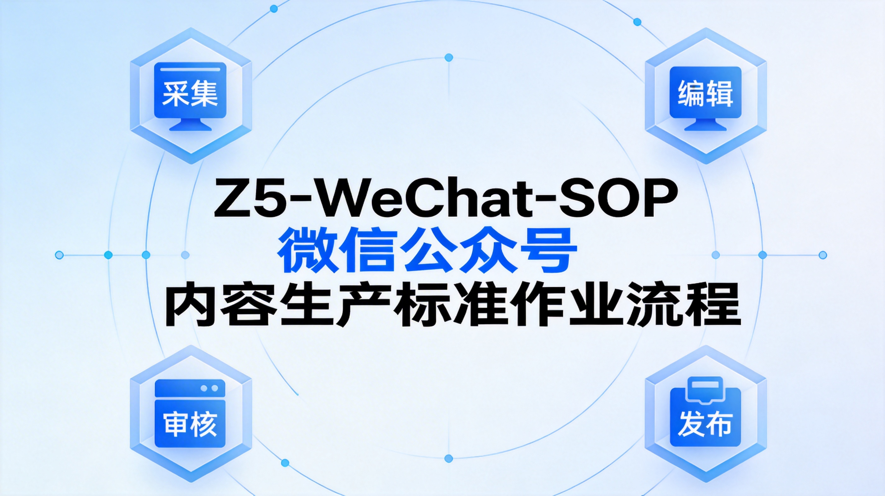

# Z5-WeChat-SOP

**微信公众号内容生产标准作业流程**

[](https://github.com/Z5Research/Z5-WeChat-SOP)
[](LICENSE)
[](https://github.com/Z5Research/Z5-WeChat-SOP/stargazers)
[](https://github.com/Z5Research/Z5-WeChat-SOP/network/members)

---



---

## 🎯 一句话安装

复制以下指令，粘贴到 AI Agent 中即可自动安装：

```
请安装 Z5-WeChat-SOP：微信公众号内容生产标准作业流程
开源地址：https://github.com/Z5Research/Z5-WeChat-SOP
文档：https://github.com/Z5Research/Z5-WeChat-SOP/blob/main/SKILL.md
自动化 · 标准化 · 可量化 · 持续进化
```

---

## 📖 项目简介

Z5-WeChat-SOP 是一套专为微信公众号内容生产设计的**端到端自动化解决方案**。通过「采集 → 编辑 → 审核 → 发布」四步标准化流程，实现内容生产的自动化、规模化、可复现化。

### 设计理念

源于媒体运营四部策略：
- **选题策划** → 热点抓取、智能选题生成
- **内容生产** → AI 写作、专业配图生成
- **质量审核** → 数据校验、来源核实、合规检查
- **分发发布** → 排版优化、草稿推送、数据归档

Z5-SOP 将这四部策略**全部自动化**，AI 替代人工操作，让内容生产高效且标准化。

---

## ✨ 核心特性

| 特性 | 说明 |
|------|------|
| **4 步标准化流程** | 采集代理 → 编辑代理 → 审核代理 → 发布代理 |
| **3 层审核机制** | 数据校验 / 来源核实 / 合规检查 |
| **AI 配图** | 火山引擎 doubao-seedream + 提示词工程师3轮法 |
| **持续进化** | Playbook 学习机制，越用越懂你的品牌 |
| **零依赖** | 自包含完整技能，不依赖外部技能 |

---

## 📊 工作流程

```
┌─────────────────────────────────────────────────────────────────┐
│                    Z5-WeChat-SOP 工作流程                         │
├─────────────────────────────────────────────────────────────────┤
│                                                                 │
│  ┌──────────┐    ┌──────────┐    ┌──────────┐    ┌──────────┐  │
│  │ 采集代理  │ → │ 编辑代理  │ → │ 审核代理  │ → │ 发布代理  │  │
│  │          │    │          │    │          │    │          │  │
│  │ 热点抓取  │    │ 文章撰写  │    │ 数据校验  │    │ 排版优化  │  │
│  │ 选题生成  │    │ AI 配图  │    │ 来源核实  │    │ 草稿推送  │  │
│  │ 关键词库  │    │ SEO 优化  │    │ 合规检查  │    │ 数据归档  │  │
│  └──────────┘    └──────────┘    └──────────┘    └──────────┘  │
│                                                                 │
│  微博热搜      AI 写作      S/A/B/C       wenyan-cli  │
│  头条热榜  →   框架模板  →   三层审核  →   草稿箱      │
│  百度热搜      专业配图      合规安全      自动归档      │
│                                                                 │
└─────────────────────────────────────────────────────────────────┘
```


---

## 📈 效率提升

| 维度 | 传统方式 | Z5-SOP | 提升 |
|------|---------|--------|------|
| 单篇耗时 | 4 小时 | 30 分钟 | **-87.5%** |
| 配图成本 | 200 元/张 | ≈0 元 | **-100%** |
| 发布频率 | 不定期 | 每日稳定 | **可控** |
| 数据校验 | 人工核对 | 3层自动审核 | **标准化** |

---

## 🚀 快速开始

### 全自动模式

```bash
python3 scripts/main.py --client 你的公众号名 --mode auto
```

### 交互模式

```bash
python3 scripts/main.py --client 你的公众号名 --mode interactive
```

### 分步执行

```bash
# Step 1: 采集热点
python3 scripts/01-collect-hotspots.py --limit 30

# Step 2: 撰写文章
python3 scripts/03-write-article.py --client 你的公众号名 --topic "选题"

# Step 3: 审核文章
python3 scripts/06-audit-article.py --client 你的公众号名

# Step 4: 发布草稿
python3 scripts/07-publish-draft.py --client 你的公众号名
```

---

## 📁 项目结构

```
Z5-WeChat-SOP/
├── scripts/                    # 14个Python脚本
│   ├── 01-collect-hotspots.py  # 热点采集
│   ├── 02-write-article.py     # 文章撰写
│   ├── 03-audit-article.py     # 内容审核
│   ├── 04-publish-draft.py    # 草稿发布
│   ├── 05-seo-optimize.py      # SEO优化
│   ├── 06-generate-images.py   # AI配图
│   ├── 07-archive-data.py      # 数据归档
│   ├── 08-fetch-stats.py       # 数据拉取
│   └── 09-learn-edits.py      # 人工修改学习
├── docs/                       # 技术文档
│   └── SPEC.md                # 详细规范文档
├── cover.png                   # 封面图
├── workflow.png                # 工作流程图
├── architecture.png            # 架构图
├── README.md                   # 本文件（中文）
├── README_EN.md               # English
├── SKILL.md                   # 一句话安装文件
├── CHANGELOG.md               # 版本更新日志
├── LICENSE                    # MIT许可证
└── requirements.txt           # Python依赖包
```

---

## 🎨 核心功能详解

### 提示词工程师3轮法

每张配图必须经过：

**第1轮：理解（Read & Analyze）**
- 仔细阅读文章核心章节
- 识别核心信息
- 确定配图类型

**第2轮：提炼（Extract & Refine）**
- 提取中文关键词
- 转化为视觉元素
- 确定配色和风格

**第3轮：优化（Optimize & Generate）**
- 组合完整提示词
- 规避审核敏感词
- 生成并检查

### 3 层审核机制

| 审核维度 | 评级 | 说明 |
|---------|------|------|
| **数据校验** | S/A/B/C | 核心数据必须 S/A 级才可发布 |
| **来源核实** | S/A/B/C | 官方/权威/主流/一般 四级 |
| **合规检查** | 通过/不通过 | 标题/客观性/逻辑/法规 |

---

## ⚙️ 配置说明

### 环境变量

```bash
# 微信公众号
export WECHAT_APP_ID=your_app_id
export WECHAT_APP_SECRET=your_app_secret

# 火山引擎（配图生成）
export VOLC_ACCESS_KEY=your_access_key
export VOLC_SECRET_KEY=your_secret_key

# 阿里云百炼（备选配图）
export BAILIAN_API_KEY=your_api_key
```

### 客户配置

```yaml
# clients/你的公众号名/style.yaml
name: "你的公众号名"
industry: "行业"
topics:
  - "内容方向 1"
  - "内容方向 2"
tone: "写作风格"
cover_style: "封面风格描述"
author: "署名"
theme: "professional-clean"
```

---

## 📖 文档导航

| 文档 | 说明 |
|------|------|
| [SKILL.md](SKILL.md) | 一句话安装文件 |
| [SPEC.md](docs/SPEC.md) | 详细技术规范 |
| [CHANGELOG.md](CHANGELOG.md) | 版本更新日志 |

---

## 🤝 贡献指南

欢迎提交 Issue 和 Pull Request！

---

## 📄 许可证

本项目采用 MIT 许可证 - 详见 [LICENSE](LICENSE) 文件

---

**让内容生产更简单，更高效，更可控。**

---

*English Version: [README_EN.md](README_EN.md)*
