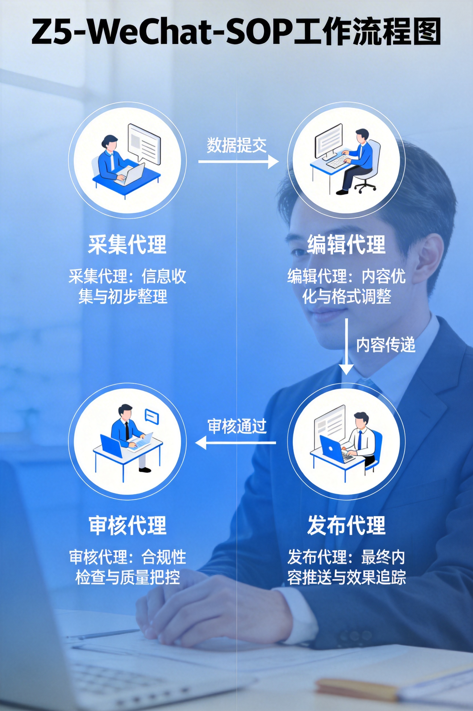

# Z5-WeChat-SOP

**WeChat Official Account Content Production Standard Operating Procedure**

[English](#english) | [简体中文](README.md#简体中文)

---

## 🎯 One-Click Installation

In OpenClaw or AI Agent environment, paste the following:

```
Please install Z5-WeChat-SOP: WeChat Official Account Content Production SOP
Automated · Standardized · Quantifiable · Continuously Evolving
```

---

## 📖 Introduction

Z5-WeChat-SOP is a comprehensive automated solution designed specifically for WeChat Official Account content production. Through the "Collection → Editing → Audit → Publishing" four-step standardized workflow, it achieves automated, scalable, and reproducible content production.

**Design Philosophy**: Originated from the four strategies of media operations - Topic Planning → Content Production → Quality Audit → Distribution Publishing. Z5-SOP automates all four strategies, with AI replacing manual operations.

---

## ✨ Core Features

| Feature | Description |
|---------|-------------|
| **4-Step Workflow** | Collection → Editing → Audit → Publishing |
| **3-Layer Audit** | Data / Source / Compliance Verification |
| **AI Images** | Volcano Engine doubao-seedream + 3-Round Prompt Engineering |
| **Continuous Learning** | Playbook mechanism, improving with usage |
| **Zero Dependencies** | Self-contained, no external skills required |

---

## 📊 Workflow



---

## 🚀 Quick Start

### Full Auto Mode

```bash
python3 scripts/main.py --client your_account --mode auto
```

### Step by Step

```bash
# Step 1: Collect hotspots
python3 scripts/01-collect-hotspots.py --limit 30

# Step 2: Write article
python3 scripts/03-write-article.py --client your_account --topic "Topic"

# Step 3: Audit article
python3 scripts/06-audit-article.py --client your_account

# Step 4: Publish draft
python3 scripts/07-publish-draft.py --client your_account
```

---

## 📁 Project Structure

```
Z5-WeChat-SOP/
├── scripts/           # 14 Python scripts
├── docs/             # Documentation
├── README.md          # Chinese version
├── README_EN.md      # This file (English)
├── CHANGELOG.md      # Changelog
├── cover.png         # Cover image
├── workflow.png      # Workflow diagram
├── architecture.png # Architecture diagram
└── requirements.txt # Dependencies
```

---

## 📖 Documentation

- [Technical Specification](docs/SPEC.md) - Detailed SOP documentation
- [Changelog](CHANGELOG.md) - Version updates

---

## 🤝 Contributing

Issues and Pull Requests are welcome!

---

## 📄 License

MIT License - See [LICENSE](LICENSE)

---

**Making content production simpler, more efficient, and more controllable.**
